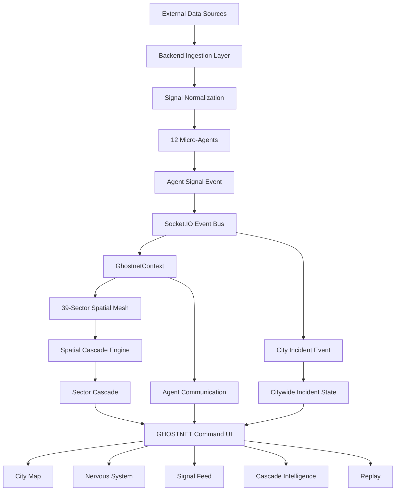

# GHOSTNET

## Urban Early-Warning & Cascade Intelligence Engine

> **Cities rarely fail because of one bad signal. They fail when independent systems begin amplifying one another.**

GHOSTNET is a spatial multi-agent intelligence platform designed to detect, understand, and visualize how isolated urban anomalies propagate across sectors, domains, and critical infrastructure.

Instead of asking only:

> **What is happening right now?**

GHOSTNET asks:

> **What is likely to happen next, where will it spread, why is it happening, and what can operators do about it?**

---

# 01. THE PROBLEM

Modern urban monitoring systems are very good at showing the current state of individual systems.

Air quality dashboards show pollution.

Traffic dashboards show congestion.

Power dashboards show load.

Emergency systems show incidents.

Hospital systems show capacity.

But cities do not operate as isolated systems.

A severe pollution event can reduce visibility.

Reduced visibility can slow public transport.

Slower transport can increase congestion.

Congestion can delay emergency response.

Delayed emergency response can increase healthcare pressure.

A local anomaly can therefore become a cross-domain urban failure.

Traditional dashboards display these events independently.

GHOSTNET models them as an interconnected system.

---

# 02. THE CORE IDEA

```text
                    +----------------------+
                    |    URBAN SIGNALS     |
                    |                      |
                    | Air · Rain · Traffic |
                    | Power · Transit · ER |
                    | Health · Social · NLP|
                    +----------+-----------+
                               |
                               v
                    +----------------------+
                    |   12 MICRO-AGENTS    |
                    |                      |
                    | Domain intelligence  |
                    +----------+-----------+
                               |
                               v
                  +-------------------------+
                  | 39-SECTOR CITY MESH     |
                  |                         |
                  | Spatial relationships   |
                  | + signal severity       |
                  +------------+------------+
                               |
                               v
                    +----------------------+
                    |   CASCADE ENGINE     |
                    |                      |
                    | Risk propagation     |
                    | Spatial decay        |
                    | Cross-domain impact  |
                    +----------+-----------+
                               |
                +--------------+--------------+
                |              |              |
                v              v              v
          Sector Cascade   City Incident   Prediction
                |              |              |
                +--------------+--------------+
                               |
                               v
                    +----------------------+
                    | GHOSTNET COMMAND UI  |
                    |                      |
                    | MAP · NERVOUS SYSTEM  |
                    | SIGNALS · CASCADES   |
                    | REPLAY · ANALYTICS   |
                    +----------------------+
```

The difference is not another dashboard.

The difference is the model of the city itself.

---

# 03. WHY GHOSTNET IS DIFFERENT

Most monitoring systems follow:

```text
Sensor
   |
   v
Chart
   |
   v
Human
```

GHOSTNET follows:

```text
Signal
   |
   v
Micro-Agent
   |
   v
Spatial Context
   |
   v
Cross-Domain Interaction
   |
   v
Cascade Propagation
   |
   v
Predicted Failure
   |
   v
Recommended Intervention
```

The platform connects four major layers:

```text
REALTIME DATA
      +
MULTI-AGENT INTELLIGENCE
      +
SPATIAL COMPUTATION
      +
TEMPORAL REPLAY
      +
DECISION SUPPORT
```

---

# 04. THE 12 MICRO-AGENT NETWORK

GHOSTNET uses a network of specialized micro-agents rather than treating the entire city as one generic AI agent.

| # | Agent | Domain | Primary Intelligence |
|---|---|---|---|
| 01 | `smog_dispersion` | Environment | Pollution, visibility and atmospheric conditions |
| 02 | `waterlogging_hydrology` | Environment | Rainfall, drainage and accumulation |
| 03 | `thermal_stress` | Environment | Temperature anomalies and heat stress |
| 04 | `transit_fleet` | Transit | Fleet speed, delay and bottlenecks |
| 05 | `road_corridor` | Transit | Corridor congestion and road capacity |
| 06 | `metro_transit` | Transit | Station inflow and passenger pressure |
| 07 | `power_grid` | Infrastructure | Transformer and grid load |
| 08 | `industrial_hazard` | Infrastructure | Industrial incidents and hazardous events |
| 09 | `hospital_capacity` | Infrastructure | ICU and hospital capacity pressure |
| 10 | `emergency_dispatch` | Civic | Emergency calls and dispatch pressure |
| 11 | `social_panic` | Civic | Public sentiment and panic propagation |
| 12 | `municipal_news` | Civic | Civic incidents, closures and disruption reports |

Each agent produces normalized intelligence that can participate in the larger cascade model.

---

# 05. THE 39-SECTOR SPATIAL MESH

GHOSTNET models Delhi as a spatial network rather than a flat collection of locations.

Each sector acts as a node.

Signals belong to sectors.

Cascades propagate between sectors.

```text
                    +-----------+
                    |  SECTOR A |
                    +-----+-----+
                          |
             +------------+------------+
             |            |            |
             v            v            v
        +--------+   +--------+   +--------+
        |SECTOR B|   |SECTOR C|   |SECTOR D|
        +----+---+   +----+---+   +----+---+
             |            |            |
             +------------+------------+
                          |
                          v
                    +-----------+
                    |  SECTOR E |
                    +-----------+
```

This gives every signal spatial context.

An anomaly close to a source sector is not treated the same as an anomaly far away.

---

# 06. SPATIAL CASCADE MODEL

GHOSTNET models spatial propagation using a distance-decay relationship:

```text
H(A -> B) = R_A * e^(-lambda * distance(A,B))
```

Where:

```text
R_A
|
+-- risk generated by source signal A

distance(A,B)
|
+-- spatial distance between sectors

lambda
|
+-- spatial decay parameter
```

Signal severity is derived from health:

```text
severity = 1 - healthScore / 100
```

Conceptually:

```text
Source Severity
      x
Agent Weight
      x
Spatial Decay
      =
Sector Contribution
```

Multiple signals can contribute to the same sector:

```text
                 SMOG
                   |
                   v
              +---------+
RAIN -------> | SECTOR  | <------- POWER
              +----+----+
                   |
                   v
                TRANSIT
```

This creates a network-level risk model rather than a collection of isolated thresholds.

---

# 07. CASCADE DETECTION

A sector becomes a candidate cascade node when accumulated propagated risk crosses the configured cascade threshold.

The cascade engine identifies:

- Primary sector
- Spatial spread
- Triggered agents
- Cascade score
- Confidence
- Predicted event
- Estimated time horizon
- Recommended interventions

Example:

```json
{
  "alertId": "ALT_2026_0811_9901",
  "primarySectorId": "DEL_CENTRAL_CP",
  "primarySectorName": "Connaught Place",
  "district": "Central Delhi",
  "cascadeScore": 0.78,
  "confidence": 89,
  "predictedEvent": "Multi-District Mobility Gridlock & Power Strain",
  "hoursUntil": 1.5,
  "spatialSpread": [
    "DEL_CENTRAL_KB",
    "DEL_OLD_CHANDNI",
    "DEL_EAST_LN"
  ],
  "triggeredAgents": [
    "transit_fleet",
    "power_grid",
    "social_panic"
  ],
  "recommendations": [
    "Deploy traffic police to direct un-signaled intersections",
    "Reroute DTC Bus Line 419",
    "Issue civic advisory"
  ],
  "timestamp": "2026-08-11T12:00:00.000Z"
}
```

---

# 08. THE AGENT SIGNAL CONTRACT

Every agent signal follows a common normalized envelope.

```json
{
  "sectorId": "DEL_EAST_LN",
  "district": "East Delhi",
  "agentId": "waterlogging_hydrology",
  "domain": "environment",
  "healthScore": 15,
  "anomalyLevel": "critical",
  "metricValue": "85mm rainfall / 12cm accumulation",
  "signal": "Underpass waterlogged at Vikas Marg",
  "isLiveAnchor": false,
  "location": {
    "placeName": "Vikas Marg Underpass, Laxmi Nagar",
    "lat": 28.6304,
    "lng": 77.2777,
    "radiusMeters": 300
  },
  "timestamp": "2026-08-11T12:00:00.000Z"
}
```

The common envelope allows the same signal to power:

```text
                 +-- CITY MAP
                 |
Signal ----------+-- AGENT CARD
                 |
                 +-- SIGNAL FEED
                 |
                 +-- SPARKLINE
                 |
                 +-- CASCADE ENGINE
                 |
                 +-- REPLAY
                 |
                 +-- ANALYTICS
```

---

# 09. CITYWIDE INCIDENT INTELLIGENCE

Sector cascades and citywide incidents are intentionally separate layers.

```text
                    CITY
                     |
        +------------+------------+
        |            |            |
        v            v            v
     DISTRICT      DISTRICT      DISTRICT
        |            |             |
      CASCADE      CASCADE       CASCADE
        |            |             |
       AGENTS       AGENTS        AGENTS
```

A citywide incident aggregates the highest-level consequences:

```text
CITYWIDE INCIDENT
|
+-- Severity
+-- Cascade Score
+-- Executive Summary
+-- Root Cause Domain
|
+-- Affected Areas
|   +-- Primary Sector
|   +-- Secondary Sectors
|   +-- Impacted Domains
|   +-- Failure Metrics
|
+-- Mitigation
    +-- Immediate Directives
    +-- Transit Rerouting
    +-- Public Advisories
```

The citywide incident schema contains:

```text
incidentId
citywideSeverity
citywideCascadeScore
summary
affectedAreas
rootCauseDomain
mitigationMeasures
timestamp
```

The important architectural boundary is:

> **Citywide incidents are backend-owned.**

The frontend renders the event it receives.

It does not invent a city incident merely because sector-level risk exists.

---

# 10. REALTIME EVENT SYSTEM

GHOSTNET uses Socket.IO as its realtime event layer.

```text
                 BACKEND
                    |
                    | Socket.IO
                    v
             +--------------+
             | useSocket()  |
             +------+-------+
                    |
        +-----------+------------+
        |           |            |
        v           v            v
     SIGNAL      CASCADE      CITY INCIDENT
        |           |            |
        +-----------+------------+
                    |
                    v
             GhostnetContext
                    |
                    v
                UI SYSTEM
```

Core events:

```text
agent-signal
cascade-alert
cascade-clear
agent-comms
city-incident
city-incident-clear
```

---

# 11. DATA PROVENANCE

GHOSTNET distinguishes signal provenance through:

```text
isLiveAnchor
```

This allows the interface to distinguish between:

```text
LIVE DATA
```

and:

```text
SIMULATED / SYNTHETIC / DERIVED DATA
```

This distinction is important for both engineering integrity and demonstration transparency.

The system can combine live anchors with normalized signals while keeping the provenance visible.

---

# 12. CROSS-DOMAIN CASCADE

Consider an apparently isolated event:

```text
PM2.5 SPIKE
```

GHOSTNET can represent the chain as:

```text
PM2.5
  |
  v
Visibility
  |
  v
Bus Speed
  |
  v
Road Congestion
  |
  +----------------+
  |                |
  v                v
Metro Inflow    Emergency Calls
  |                |
  v                v
Station Stress  Dispatch Load
  |                |
  +-------+--------+
          |
          v
   City Mobility Risk
          |
          v
  Healthcare Pressure
```

The system therefore focuses on relationships rather than isolated values.

---

# 13. AGENT COMMUNICATION

GHOSTNET exposes cross-agent interactions.

Example:

```text
SMOG & DISPERSION
        |
        | visibility below threshold
        v
BUS FLEET
        |
        | speed degradation detected
        v
ARTERIAL CONGESTION
        |
        | corridor capacity collapsing
        v
METRO TRANSIT
        |
        | passenger overflow
        v
EMERGENCY DISPATCH
```

Instead of simply displaying:

```text
Risk Score = 87
```

the platform can explain:

```text
Visibility degradation
        ->
Transit capacity degradation
        ->
Road congestion
        ->
Emergency response pressure
```

That makes the cascade understandable to an operator.

---

# 14. NERVOUS SYSTEM VIEW

The Nervous System treats the city as a living network.

Instead of asking:

> Which card is red?

it asks:

> Where is the city's stress propagating?

The visualization connects:

```text
AGENT
  |
  v
SECTOR
  |
  v
DOMAIN
  |
  v
CASCADE
  |
  v
CITY
```

This exposes relationships that conventional card-based dashboards hide.

---

# 15. HISTORICAL REPLAY

GHOSTNET is designed to answer:

> **How did we get here?**

rather than only:

> **What is happening now?**

Replay reconstructs the progression of signals over time.

```text
T-38h
  |
  +-- weak anomaly
  |
T-24h
  |
  +-- regional degradation
  |
T-12h
  |
  +-- cross-domain interaction
  |
T-06h
  |
  +-- cascade formation
  |
T-01h
  |
  +-- critical city impact
```

Replay acceleration allows the complete evolution to be observed quickly:

```text
1x
5x
10x
```

The same visualization layer can consume the changing temporal state.

---

# 16. INTERVENTION INTELLIGENCE

Detection without action is incomplete.

GHOSTNET attaches recommendations to cascade events.

Example:

```text
CASCADE DETECTED

PRIMARY
Connaught Place

CONFIDENCE
89%

TRIGGERED
Transit Fleet
Power Grid
Social Panic

IMMEDIATE DIRECTIVE
Deploy traffic response teams

TRANSIT
Reroute affected corridors

PUBLIC
Issue civic advisory
```

The system therefore moves from:

```text
OBSERVATION
```

to:

```text
DECISION SUPPORT
```

---

# 17. COMMAND INTERFACE

GHOSTNET is designed as an operational command interface rather than a conventional analytics dashboard.

```text
+-------------------------------------------------------+
|                    GHOSTNET                           |
|                 COMMAND INTERFACE                     |
+-------------------------------------------------------+
|                                                       |
|                    CITY MAP                            |
|                                                       |
|        o------o------o------o                         |
|       /        \             \                        |
|      o          o------o------o                       |
|                                                       |
+---------------------------+---------------------------+
| SIGNAL NETWORK            | CASCADE INTELLIGENCE     |
|                           |                           |
| Agent health              | Primary sector           |
| Domain status             | Spatial spread           |
| Live signals              | Confidence               |
| Signal history            | Recommendations          |
+---------------------------+---------------------------+
|              AGENT COMMUNICATION FEED                 |
+-------------------------------------------------------+
```

Core interfaces include:

- City Map
- Nervous System
- Signal Feed
- Sector Browser
- Sector Detail
- Cascade Intelligence
- City Incident Intelligence
- Agent Communication
- Historical Replay
- Schema Documentation

---

# 18. SEVERITY MODEL

Individual agent signals use three primary states:

```text
+---------------+
|   NOMINAL     |
|   healthy     |
+---------------+

+---------------+
|   WARNING     |
|   degrading   |
+---------------+

+---------------+
|   CRITICAL    |
|   failing     |
+---------------+
```

Cascade state is deliberately separate from individual signal severity.

A signal can be moderate while still contributing significantly to a larger cascade.

This prevents the platform from reducing intelligence to:

```text
red = danger
green = safe
```

---

# 19. SYSTEM ARCHITECTURE



---

# 20. FRONTEND ARCHITECTURE

```text
src/
|
+-- assets/
|
+-- components/
|   |
|   +-- dashboard/
|   |   +-- AgentCard.jsx
|   |   +-- CascadeAlertTray.jsx
|   |   +-- CityCascadePanel.jsx
|   |   +-- CityIncidentDrawer.jsx
|   |   +-- DomainBreakdown.jsx
|   |   +-- JudgeDemoPanel.jsx
|   |   +-- SectorCascadePanel.jsx
|   |   +-- SignalFeed.jsx
|   |   +-- TopThreats.jsx
|   |
|   +-- sectors/
|   |   +-- DistrictSection.jsx
|   |   +-- SectorPill.jsx
|   |
|   +-- shared/
|       +-- SeverityLegend.jsx
|       +-- Sidebar.jsx
|       +-- Topbar.jsx
|
+-- context/
|   +-- GhostnetContext.jsx
|   +-- ReplayContext.jsx
|
+-- hooks/
|   +-- useMockStream.js
|   +-- useReplayEngine.js
|   +-- useSocket.js
|   +-- useSparklineData.js
|
+-- lib/
|   +-- citySeverity.js
|   +-- replayData.js
|   +-- schema.js
|   +-- sectors.js
|   +-- theme.js
|
+-- pages/
|   +-- CascadeLog.jsx
|   +-- Citymap.jsx
|   +-- Dashboard.jsx
|   +-- NervousSystem.jsx
|   +-- Replay.jsx
|   +-- SchemaDocs.jsx
|   +-- SectorBrowser.jsx
|   +-- SectorDetail.jsx
|
+-- App.css
+-- App.jsx
+-- index.css
+-- main.jsx
```

---

# 21. STATE ARCHITECTURE

`GhostnetContext` acts as the frontend state boundary.

```text
                    GhostnetContext
                           |
          +----------------+----------------+
          |                |                |
       signals          cascades       cityIncident
          |                |                |
          v                v                v
       sectors        cascade UI       city UI
          |
          v
       feed / stats
```

The context provides shared state for:

- Signals
- Sectors
- Signal feed
- Cascades
- Cascade history
- City incidents
- City incident history
- Agent communications
- Cascade acknowledgements
- Backend connection state

This gives the application a consistent source of truth.

---

# 22. LIVE VS REPLAY

GHOSTNET intentionally separates live intelligence from historical reconstruction.

## LIVE

```text
Backend
  |
  v
Socket.IO
  |
  v
Signals
  |
  v
Current City State
```

## REPLAY

```text
Historical Dataset
       |
       v
Replay Engine
       |
       v
Time-Controlled Signals
       |
       v
Same Visualization Layer
```

The visualization system can therefore operate against both realtime and historical temporal states.

---

# 23. DATA FLOW

A single backend signal can flow through the entire platform:

```text
Backend
   |
   v
Socket.IO
   |
   v
useSocket
   |
   v
GhostnetContext
   |
   +----------+----------+----------+
   |          |          |          |
   v          v          v          v
 Sector     Agent      Signal     Map
 State      Card       Feed
   |
   v
Sparkline
   |
   v
Cascade Engine
   |
   v
Cascade Intelligence
```

This architecture ensures that the same source data powers multiple surfaces rather than each component inventing its own interpretation.

---

# 24. THE WINNING DEMO

The strongest demonstration is designed as a narrative rather than a feature tour.

## Scene 1 — Calm City

Open the dashboard.

```text
CITY STATUS

NOMINAL
```

Show the 39-sector spatial mesh.

Show the agent network.

---

## Scene 2 — Introduce an Anomaly

A signal arrives:

```text
SMOG & DISPERSION

Health: 31
Status: CRITICAL
```

The audience sees the signal before hearing the explanation.

---

## Scene 3 — Spatial Propagation

The source sector becomes active.

Nearby sectors begin receiving propagated risk.

Explain:

> "The system is not just detecting the anomaly. It is evaluating where its effects can propagate."

---

## Scene 4 — Cross-Domain Reaction

Open the agent communication feed.

```text
SMOG
  |
  v
TRANSIT
  |
  v
CONGESTION
  |
  v
METRO
```

The audience sees the chain forming.

---

## Scene 5 — Cascade

Open the cascade panel.

```text
CASCADE DETECTED

Confidence: 89%

Primary:
Connaught Place

Spread:
3 sectors

Triggered:
Transit
Power
Social
```

---

## Scene 6 — Historical Replay

Switch to Replay.

Increase the speed:

```text
10x
```

Watch the cascade form.

The audience now sees not only the emergency, but the sequence that produced it.

---

## Scene 7 — Intervention

Show recommendations:

```text
IMMEDIATE DIRECTIVE
TRAFFIC REROUTING
PUBLIC ADVISORY
```

The final message:

> **The objective is not to tell the city that it is failing. It is to give operators enough warning to prevent the failure from becoming systemic.**

---

# 25. THE 30-SECOND PITCH

> **Cities don't collapse because one sensor turns red. They collapse because failures propagate between systems. GHOSTNET models Delhi as a 39-sector spatial mesh powered by 12 specialized micro-agents. It receives realtime signals, understands their spatial relationships, detects cross-domain cascades, exposes how risk propagates through the city, and provides intervention intelligence. Instead of asking what is broken right now, GHOSTNET asks what is likely to break next, where it will spread, why it is happening, and what operators can do about it.**

---

# 26. THE 90-SECOND JUDGE STORY

```text
NORMAL CITY
     |
     v
ANOMALY
     |
     v
SPATIAL PROPAGATION
     |
     v
CROSS-DOMAIN INTERACTION
     |
     v
CASCADE DETECTION
     |
     v
CITYWIDE IMPACT
     |
     v
INTERVENTION
```

The audience should never have to imagine the cascade.

They should be able to watch it happen.

---

# 27. PROJECT STRUCTURE

```text
GHOSTNET
|
+-- Frontend
|   |
|   +-- React
|   +-- Vite
|   +-- Tailwind
|   +-- Recharts
|   +-- Cesium
|   +-- Socket.IO Client
|
+-- Intelligence
|   |
|   +-- 12 Micro-Agents
|   +-- Signal Normalization
|   +-- Spatial Propagation
|   +-- Cascade Detection
|   +-- City Incident Aggregation
|
+-- Realtime
|   |
|   +-- Socket.IO
|   +-- Agent Signals
|   +-- Cascade Alerts
|   +-- Agent Communications
|   +-- City Incidents
|
+-- Temporal
|   |
|   +-- Replay Engine
|   +-- Historical Signals
|   +-- Time Acceleration
|
+-- Visualization
    |
    +-- City Map
    +-- Nervous System
    +-- Agent Cards
    +-- Signal Feed
    +-- Cascade Intelligence
    +-- City Incident Intelligence
```

---

# 28. GETTING STARTED

## Requirements

- Node.js
- npm
- Running GHOSTNET backend
- Socket.IO-compatible backend endpoint

## Installation

```bash
git clone <YOUR_REPOSITORY_URL>
cd <YOUR_PROJECT_DIRECTORY>
npm install
```

## Environment

Create:

```text
.env
```

Example:

```env
VITE_BACKEND_URL=http://localhost:3001
```

## Run

```bash
npm run dev
```

---

# 29. BACKEND REQUIREMENTS

The frontend expects the backend to provide the realtime event layer.

Required event types:

```text
agent-signal
cascade-alert
cascade-clear
agent-comms
city-incident
city-incident-clear
```

Payloads should remain consistent with the shared contracts.

Core fields include:

```text
sectorId
agentId
healthScore
anomalyLevel
location
timestamp
```

Do not silently rename or reinterpret shared fields.

Schema consistency allows one signal to power:

```text
MAP
CARD
FEED
SPARKLINE
CASCADE
REPLAY
ANALYTICS
```

---

# 30. ENGINEERING PRINCIPLES

## Data before decoration

Every visualization should answer a question.

## Spatial context matters

A risk without a location is incomplete.

## Time matters

A snapshot cannot explain a cascade.

## Cross-domain relationships matter

Environmental, mobility, infrastructure and civic systems interact continuously.

## Provenance matters

Live, synthetic and derived signals should not be indistinguishable.

## Explain the cascade

Do not only say:

```text
CRITICAL
```

Explain:

```text
WHY
WHERE
HOW
WHAT NEXT
```

---

# 31. WHAT MAKES THE SYSTEM DEEP

The project is not defined by the number of cards on the screen.

Its depth comes from the interaction between layers:

```text
                    DATA
                      |
                      v
                  AGENTS
                      |
                      v
                  SECTORS
                      |
                      v
                  DOMAINS
                      |
                      v
                  CASCADE
                      |
                      v
                  PREDICTION
                      |
                      v
                INTERVENTION
```

A city signal becomes meaningful only when its context is understood.

A cascade becomes meaningful only when its propagation is understood.

A prediction becomes valuable only when it provides enough warning to act.

---

# 32. FUTURE EVOLUTION

The architecture allows additional capabilities without replacing the core system.

Potential extensions include:

```text
Forecast Calibration
        |
        v
Prediction Accuracy
        |
        v
False Positive Analysis
        |
        v
Intervention Outcome Tracking
        |
        v
Model Feedback
        |
        v
Improved Cascade Prediction
```

The long-term objective is to move from:

```text
DETECTION
```

to:

```text
PREDICTION
```

and eventually:

```text
PRESCRIPTION
```

---

# 33. THE LONG-TERM VISION

Delhi is not 39 separate sectors.

It is one interconnected system.

Roads depend on visibility.

Transit depends on roads.

Hospitals depend on mobility.

Emergency services depend on response corridors.

Power affects traffic infrastructure.

Public perception affects demand.

Weather affects almost everything.

GHOSTNET is built around the idea that these dependencies can be modeled.

```text
                    +-------------+
                    | ENVIRONMENT |
                    +------+------+
                           |
                  +--------v--------+
                  |     MOBILITY    |
                  +--------+--------+
                           |
               +-----------v-----------+
               |     INFRASTRUCTURE    |
               +-----------+-----------+
                           |
                  +--------v--------+
                  |      CIVIC      |
                  +--------+--------+
                           |
                  +--------v--------+
                  |    HEALTHCARE   |
                  +-----------------+
```

The city becomes a graph.

The agents become nodes of intelligence.

The signals become observations.

The cascade becomes the prediction.

The operator gets something more valuable than another dashboard:

# TIME TO ACT.

---

# 34. THE FINAL IDEA

A normal dashboard asks:

```text
Which sensor is bad?
```

GHOSTNET asks:

```text
Which relationships are becoming dangerous?
```

A normal alert asks:

```text
What happened?
```

GHOSTNET asks:

```text
What happened?
Where?
Why?
What is it affecting?
Where will it spread?
How confident are we?
What should operators do?
```

A normal historical chart shows:

```text
PAST -> PRESENT
```

GHOSTNET attempts to reconstruct:

```text
PAST
 |
 v
CAUSE
 |
 v
PROPAGATION
 |
 v
CASCADE
 |
 v
FAILURE
```

That is the core philosophy of the platform.

---

# 35. SUCCESS METRIC

The ultimate metric is not:

```text
Number of charts
```

It is not:

```text
Number of AI agents
```

It is:

```text
WARNING TIME
```

If GHOSTNET can identify a developing cross-domain failure before it becomes obvious to a human operator, the system has created operational value.

The desired progression is:

```text
                    INCIDENT
                       ^
                       |
                +------+------+
                |   DETECTED  |
                +------+------+
                       |
                   TOO LATE
                       |
------------------------------------------------
                       |
                   GHOSTNET
                       |
                       v
                 EARLY WARNING
                       |
                       v
                  INTERVENTION
                       |
                       v
                FAILURE REDUCED
```

---

# GHOSTNET

## See the signal.

## Understand the relationship.

## Predict the cascade.

## Act before the city breaks.

---

<div align="center">

**GHOSTNET**

**Urban Early-Warning & Cascade Intelligence Engine**

*Built for the city that has not failed yet.*

</div>